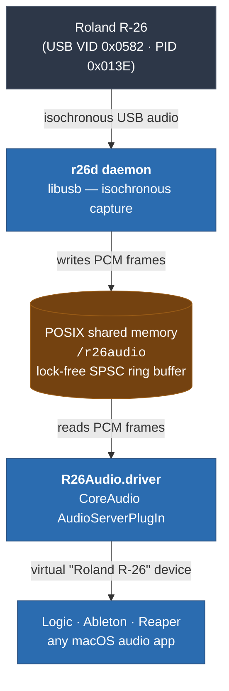

## Architecture



  Components

  1. src/shared/RingBuffer.h — Lock-free SPSC ring buffer via POSIX shared memory, used by both components
  2. src/daemon/ (r26d) — libusb daemon that detects the R-26, reads isochronous audio packets, converts 24-bit PCM
  to float, writes to shared memory
  3. src/driver/ (R26Audio.driver) — CoreAudio AudioServerPlugIn that reads from shared memory and appears as
  "Roland R-26" input device in macOS
  4. scripts/install.sh / scripts/uninstall.sh — Install/remove both components

  How to use

```bash
cd build && make -j$(sysctl -n hw.ncpu) && sudo cp r26d /usr/local/bin/r26d && sudo r26d
```


  1. Install:
  sudo ./scripts/install.sh
  1. This copies the driver to /Library/Audio/Plug-Ins/HAL/ and the daemon to /usr/local/bin/.
  2. Restart CoreAudio:
  sudo launchctl kickstart -kp system/com.apple.audio.coreaudiod
  3. Connect R-26 (set to USB Audio Interface mode: Menu → AUDIO I/F)
  4. Probe first (to see USB descriptors and verify detection):
  sudo r26d --probe
  5. Start capturing:
  sudo r26d
  6. Select "Roland R-26" as input in Audio MIDI Setup or your DAW.

  Important notes

  - The original driver is an x86_64-only kernel extension — it cannot work on macOS 15.6 (kexts are deprecated, no
  ARM64 support)
  - This user-space bridge bypasses all kernel signing/notarization issues
  - The --probe flag is critical for the first run — it dumps the R-26's actual USB descriptors so we can verify the
   endpoint layout and packet format
  - If the audio format doesn't match the defaults (48kHz/24-bit/stereo), the probe output will reveal the actual
  parameters, and the daemon's format detection can be refined

  Hot-plug / fallback behaviour

  The CoreAudio plugin tracks the daemon's shared memory and only advertises the
  "Roland R-26" device while the daemon is running and producing audio. A
  background monitor thread polls the SHM every 300 ms and watches for a
  heartbeat (advancing input ring-buffer write position).

  - When the R-26 is disconnected, the isochronous USB transfers fail, the
    daemon exits cleanly and unlinks the SHM. Within ~300 ms the driver sees
    the SHM is gone, flips `kAudioDevicePropertyDeviceIsAlive` to 0 and
    removes the device from `kAudioPlugInPropertyDeviceList`, firing the
    required `PropertiesChanged` notifications. macOS then automatically
    switches the default input/output back to the previously-selected device.
  - When the R-26 is reconnected and the daemon is restarted (launchd with
    `KeepAlive` relaunches it), the monitor detects the new SHM inode, remaps
    it with a 100 ms grace before unmapping the stale one, and re-advertises
    the device.
  - If the daemon is killed ungracefully (SIGKILL, crash) so the SHM is not
    unlinked, the heartbeat check still catches it after ~3 s of no new
    frames and tears the device down the same way.

  This means you do not need to restart CoreAudio or your DAW when the R-26
  is unplugged — the default device falls back on its own, and the R-26
  reappears automatically on reconnect.

  ```

            R-26(AUDIO):

              Product ID: 0x013e
              Vendor ID: 0x0582  (Roland Corporation)
              Version: 0.00
              Speed: Up to 480 Mb/s
              Manufacturer: Roland
              Location ID: 0x02110000 / 8
              Current Available (mA): 500
              Extra Operating Current (mA): 0
```